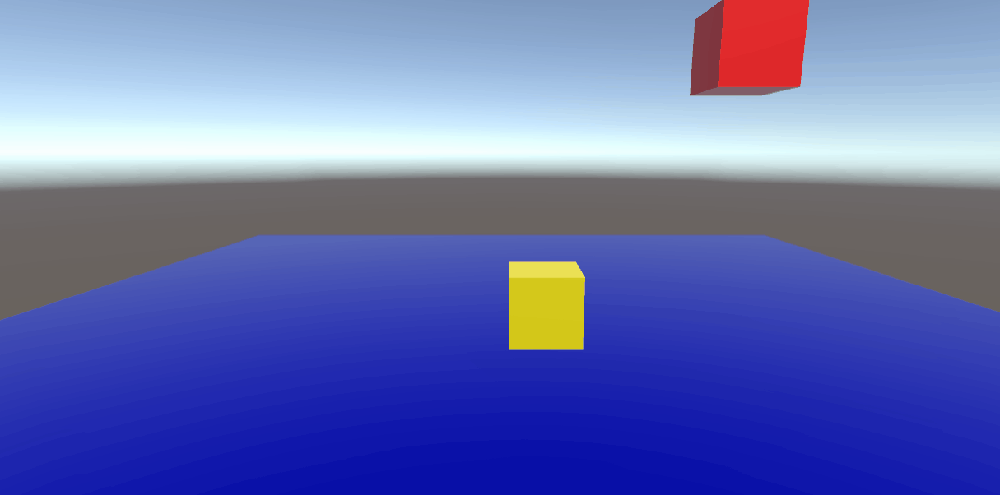

# Vectores-y-Movimiento


## Ejercicio 1

En un ejemplo donde la coordenada del Vector en el eje Y es 1 (0,1,0) el objeto se impulsa hacia arriba pero cae debido a la gravedad que le otorga el componente "Rigidbody":


Para lograr que el objeto salga volando, podemos desactivar la gravedad desde el Rigidbody, dando lugar al siguiente resultado:


## Ejercicio 2

Duplicando los valores del Vector en X, Y, Z hacemos que la esfera se mueva el doble de rapido:

Valor original:


Valor con los vectores duplicados:


Sin embargo, al usar desde el script el vector normalizado (goal.normalized) solo nos quedamos con la información referente a la dirección del vector sin que afecte el hecho de haber duplicado sus valores de forma que conserva la misma velocidad que el original.

 A su vez, debemos usar Time.deltaTime para evitar la inconsistencia del Update(), ya que el tiempo que pasa entre un frame y otro dentro de este no es siempre el mismo.
 
 El translate quedaría como:
 
 ```
 t.Translate(goal.normalized * Time.deltaTime * speed);
 ```
 
 ## Ejercicio 3
 
 Restando la posición del objetivo con la posición del objeto a mover, podemos calcular el vector entre estos dos y moverlo en esa dirección:
 
 
 
 ## Ejercicio 4
 
 Para evitar el jittering, establecemos un accuracy:
 
  
 
 ## Ejercicio 5
 
 Con el método LookAt en el Start() hacemos que el objeto mire hacia el objetivo, para poder movernos hacia esa dirección, necesitamos hacerlo con el sistema de referencia del mundo con la opción Space.World dentro del Translate:
 
  
 
 ## Ejercicio 6
 
 Con Debug.DrawRay, podremos dibujar la dirección a la que apunta el vector y verlo activando Gizmos. Aparte para lograr que pare en el objetivo, cambiamos el calculo de la dirección del Start al Update() de forma que cuando llegue a su objetivo, el vector sea (0,0,0) y deje de moverse:
 
  
 
 ## Ejercicio 7
 
 Añadimos la posibilidad del jugador de moverse por el escenario y establecemos otro objeto cuyo objetivo es el propio jugador al moverse. De esta forma podemos simular que el objeto nos sigue.
 
  
 
 ## Ejercicio 8
 
 ### A) Ninguno de los objetos es físico.
  -> Los objetos permanecen estáticos al no verse afectados por ninguna física.
 
 
 
 ### B) Las esfera tiene físicas, el cubo no, pero se puede mover por el controlador en 3ª persona de los starter Assets.
  -> Al no tener físicas el cubo, este no cae al suelo por no tener gravedad, aparte algunas colisiones ocurren porque el cubo sigue teniendo un Collider, pero las físicas no se calculan del todo bien por lo que a veces se atraviesan las esferas.
 
 
 
 ### C) Las esferas y el cubo tienen físicas. El cubo inicialmente está posicionado más alto que alguna de las esferas, con el mismo valor de x, z.
  -> Colocando el cubo encima de la esfera ambos con el componente Rigidbody, se produce una colisión donde el cubo termina cayendo por un lado y golpeando a la esfera.
 
 
 
  ### D) Una escena similar a la c, pero alguna esfera tiene 10 veces la masa del cubo.
  -> Esta vez, la esfera tiene una masa de 10 y el cubo una masa de 1, por lo tanto cuando el cubo cae sobre la esfera, esta apenas se mueve del sitio.
 
 
 
  ### E) Las esferas tienen físicas y el cubo es de tipo IsTrigger estático.
  -> Al activar el isTrigger del cubo, este posee las físicas del rigidBody, pero ya no es afectado por el resto de objetos y los atraviesa. La intención del isTrigger   aqui es para que se use como detector de colisiones con otros objetos.
 
 
 
  ### F) Las esferas tienen físicas, el cubo es de tipo IsTrigger y cinemático.
  -> Al activar is Kinematic, el cubo ya no es afectado por ninguna de las físicas a pesar de tener un rigidBody, el objeto solo se podra mover con el uso de un      script.
 
 
 
  ### G) Las esferas tienen físicas, el cubo es de tipo IsTrigger y mecánico.
  -> Al ser IsTrigger el cubo las demas esferas lo atraviesan.
 
 
 
  ### H) Una esfera y el cubo son físicos y la esfera tiene 10 veces la masa del cubo, se impide la rotación del cubo sobre el plano XZ.
  -> Al bloquear las rotaciones en el plano XZ, el cubo se mantiene sobre la esfera y no puede caerse al no poder rotar.
 
 
 
  ## Ejercicio 9
 
 Haciendo uso del Input.GetAxis('Vertical') y Input.GetAxis('Horizontal') podemos hacer que el jugador se mueva hacia adelante y hacia atras o que rote sobre si mismo y cambie la dirección a la que se mueve. 

Ademas se modifica la velocidad pulsando la barra espaciadora:
 
 ```
         transform.Translate(0, 0, Input.GetAxis("Vertical") * speed * Time.deltaTime);
        transform.Rotate(0, Input.GetAxis("Horizontal") * rotationSpeed * Time.deltaTime, 0);

        if(Input.GetKey(KeyCode.Space)){
            speed = 12f;
        }else
            speed = 6f;
 ```
 
  
  
   ## Ejercicio 10
 
 Cada uno de los Cilindros son Trigger, de forma que contengan un Script con la función OnTriggerEnter(), que detecta las colisiones del jugador al entrar al cilindro.

Desde aqui se llama a una función pública del jugador llamado addPoints, donde le pasamos el número de puntos que queremos sumar, tambien cambiamos el color del material accediendo al Renderer del cilindro e imprimimos el nombre.
 
 Al salir del cilindro, se activa OnTriggerExit para volver el color del cilindro al original.

Implemente ademas un Canvas para poder ver el número de puntos en la interfaz del juego.
 
  
