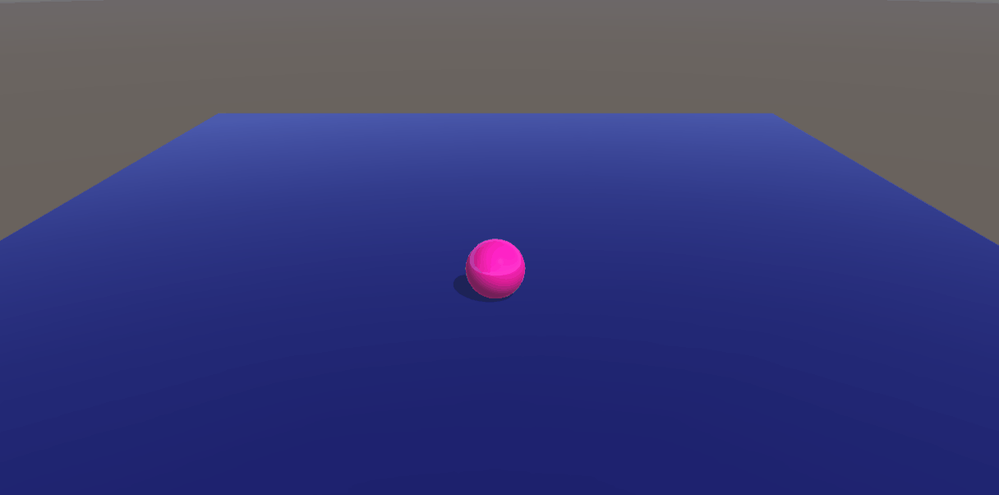

# Vectores-y-Movimiento


## Ejercicio 1

En un ejemplo donde la coordenada del Vector en el eje Y es 1 (0,1,0) el objeto se impulsa hacia arriba pero cae debido a la gravedad que le otorga el componente "Rigidbody":



Para lograr que el objeto salga volando, podemos desactivar la gravedad desde el Rigidbody, dando lugar al siguiente resultado:


## Ejercicio 2

Duplicando los valores del Vector en X, Y, Z hacemos que la esfera se mueva el doble de rapido:

Valor original:


Valor con los vectores duplicados:


Sin embargo, al usar desde el script el vector normalizado (goal.normalized) solo nos quedamos con la información referente a la dirección del vector sin que afecte el hecho de haber duplicado sus valores de forma que conserva la misma velocidad que el original.

 A su vez, debemos usar Time.deltaTime para evitar la inconsistencia del Update(), ya que el tiempo que pasa entre un frame y otro dentro de este no es siempre el mismo.
 
 El translate quedaría como:
 
 ```
 t.Translate(goal.normalized * Time.deltaTime * speed);
 ```
 
 ## Ejercicio 8
 
 ### A) Ninguno de los objetos es físico.
  -> Los objetos permanecen estáticos al no verse afectados por ninguna física.
 
 
 
 ### B) Las esfera tiene físicas, el cubo no, pero se puede mover por el controlador en 3ª persona de los starter Assets.
  -> 
 
 
 
 ### C) Las esferas y el cubo tienen físicas. El cubo inicialmente está posicionado más alto que alguna de las esferas, con el mismo valor de x, z.
  -> 
 
 
 
  ### D) Una escena similar a la c, pero alguna esfera tiene 10 veces la masa del cubo.
  -> 
 
 
 
  ### E) Las esferas tienen físicas y el cubo es de tipo IsTrigger estático.
  -> 
 
 
 
  ### F) Las esferas tienen físicas, el cubo es de tipo IsTrigger y cinemático.
  -> 
 
 
 
  ### G) Las esferas tienen físicas, el cubo es de tipo IsTrigger y mecánico.
  -> 
 
 
 
  ### H) Una esfera y el cubo son físicos y la esfera tiene 10 veces la masa del cubo, se impide la rotación del cubo sobre el plano XZ.
  -> 
 
 
